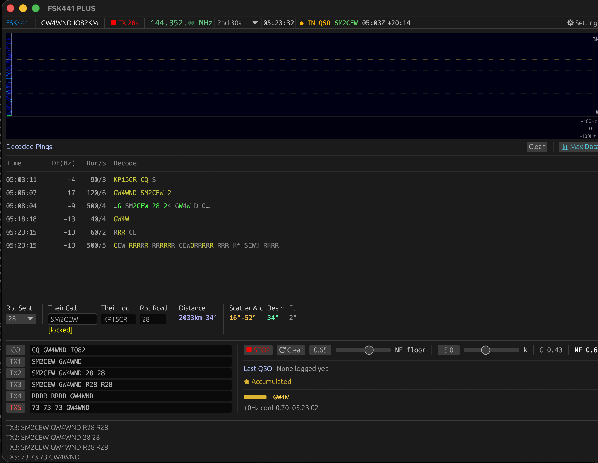

# FSK441+
High-performance FSK441 meteor scatter transceiver for macOS, Linux and Windows.
Developed by Roger Banks GW4WND

Developed by Roger Banks GW4WND



## Features
- Real-time FSK441 decode with waterfall display
- Soft-bit accumulator — merges weak ping fragments for clean decodes
- Second-pass decoder — scores sub-threshold pings against QSO hypothesis during TX
- Two-arm adaptive threshold, data-validated against real QSOs
- Background threshold optimiser — learns your noise floor automatically
- Auto-calibration on first run — thresholds set after ~30 decodes, no manual tuning needed
- QSO mode with automatic constraint-guided decoding
- CAT control via hamlib (rigctld) with inline KHz frequency entry
- PTT via CAT, RTS, DTR or VOX — configurable per station
- Audio input level indicator in header bar — colour-coded for gain guidance
- ADIF logging to `~/.fsk441/fsk441.adi`
- QSO transcript export (clipboard + file)
- SQLite session database with WAL journaling
- Max Data mode — retains soft-bit captures for off-line analysis

## Download
Pre-built Windows release available on the [Releases](https://github.com/Nythbran23/FSK441-PLUS/releases) page.  
Extract the zip and run `fsk441plus.exe` — no installation required.  
Hamlib (`rigctld.exe`) is bundled in the `tools\` subfolder.

## Build from source
```bash
git clone https://github.com/Nythbran23/FSK441-PLUS.git
cd FSK441-PLUS
cargo build --bin fsk441plus --release
./target/release/fsk441plus
```

### Linux build dependencies
```bash
sudo apt-get install libasound2-dev libgtk-3-dev \
  libxcb-render0-dev libxcb-shape0-dev libxcb-xfixes0-dev \
  libxkbcommon-dev pkg-config
```

## First run / new users
On first launch FSK441+ will auto-calibrate its noise thresholds after approximately
30 decoded pings (~30–60 seconds on a typical band). The **Reset & Recalibrate**
button appears in Settings until calibration completes, then disappears automatically.

If you are seeing too much garbage or missing real signals, open Settings and click
**Reset & Recalibrate** — this clears the threshold history and retrains from the
current band conditions.

## CAT and PTT setup
1. Enable **CAT Control** in Settings and select your rig and COM port
2. Set **PTT Method**: CAT (via Hamlib), RTS, DTR, or VOX
3. For RTS/DTR PTT, select the dedicated PTT serial port
4. Click **Save & Close** — rigctld restarts automatically with the new settings

On Windows, `rigctld.exe` is bundled in the `tools\` subfolder alongside the required
Hamlib DLLs. No separate Hamlib installation is needed.

## Geographic callsign validation
Place `cty.dat` (from WSJT-X or MSHV) alongside the binary, or specify
the path in Settings. Enables geographic filtering of implausible callsigns.

## Data files
All data stored in `~/.fsk441/` (macOS/Linux) or `C:\Users\<n>\.fsk441\` (Windows):

| File | Contents |
|------|----------|
| `fsk441.db` | SQLite session database (pings, threshold history, soft-bit captures) |
| `fsk441.adi` | ADIF log (compatible with WSJT-X, HAMRS, LoTW) |
| `fsk441.cfg` | Settings |
| `transcripts/` | QSO transcript exports |

## License 013ff11 (v0.1.13: TX Audio gating)
MIT — © 2026 Roger Banks GW4WND
